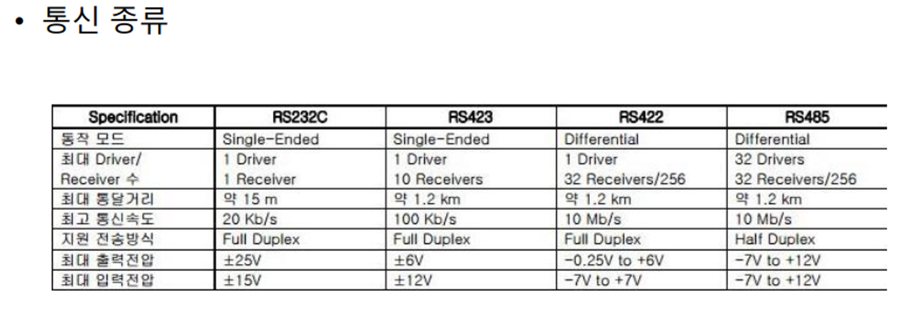
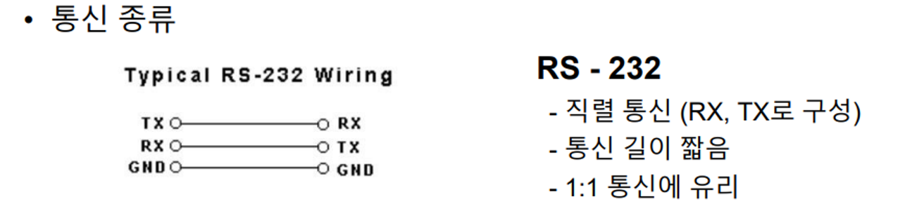
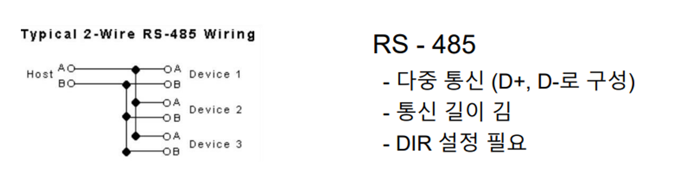
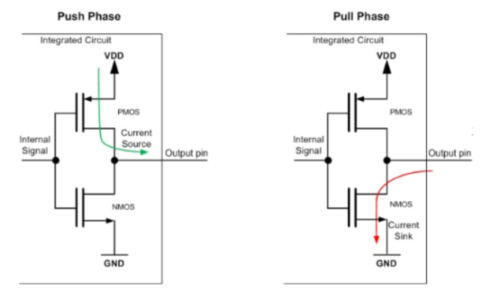
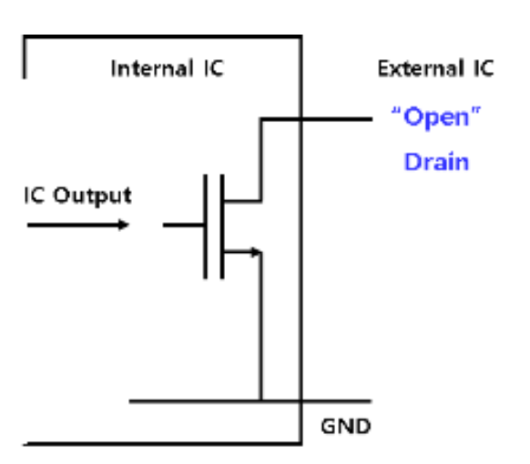
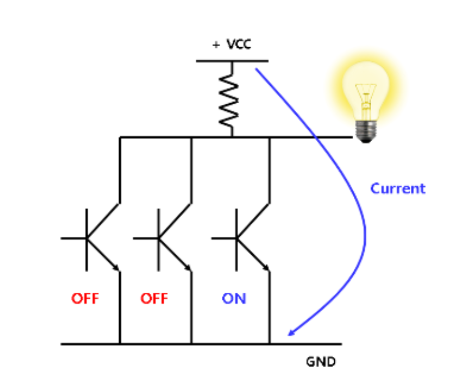
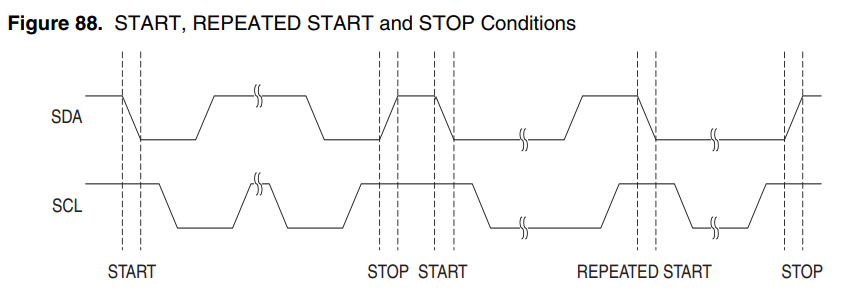
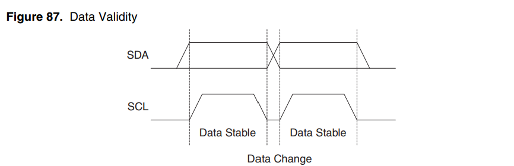
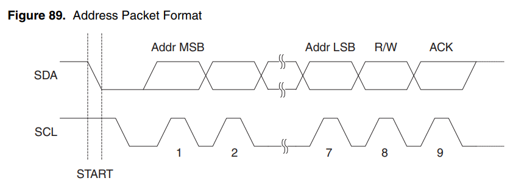

# UART 통신에서 사용되는 232 통신과 485 통신에 대한 보고서(차이, 장단점 등)

## UART와 다른점

UART는 전기적 신호를 어떻게 규칙적으로 배열하는지에 대한 것이고, RS-232 / RS-485는 이것을 전기적으로 어떻게 표현할지에 대한거다. 
 
예를 들어 같은 UART를 다른 전기적 표현으로 나타낼 수 있는데 
- ttl
- RS-232
- RS-485
 와 같은것이 있다.

## Single-ended와 Differential의 차이

 
사진에 보이는 것처럼 RS-232C와 RS-485의 차이 중에는 Single-ended와 Differential이 있다. single ended는 선 한 가닥의 전압을 gnd의 기준으로 측정하고, differential은 두 가닥의 차이를 측정하는 것이다. diffrential처럼 두 가닥을 꼬아서 나란히 논다면 외부 노이즈가 두 선에 비슷하게 노출된다. 따라서 두 선의 차이는 변하지 않으므로 측정값이 거의 바뀌지 않는다. 이 차이 때문에 두 방식의 통신거리가 확연하게 차이 난다.

## 반이중과 DIR핀

 
RS-485는 선이 두 가닥 뿐이다. 이 두선은 각각 RX와 TX의 역할을 하는것이 아닌 D+-의 역할이기 떄문에 송수신을 함께 할 수 없다. 그렇다면 송신과 수신을 번갈아 가면서 해야하는데 이때 DIR설정이 필요한 것이다. MAX485칩에는 이걸 위해 DE(driver enable), RE(receiver enable)칩이 있다. 

(예)

- DIR_HIGH();              // 송신 모드로 전환 
- Uart_Putch(data);        // 데이터 보냄 
- while (!(UCSR0A & (1 << TXC0)));   // 완전히 다 나갈 때까지 대기 
- DIR_LOW();               // 수신 모드로 복귀 

만약 TXC를 안 쓴다면 시프트레지스터에 남아있는 마지막 비트 몇개가 잘려나간다. 따라서 TXC를 반드시 써야한다.(TXC는  UCSRnA에서 6비트에 있는건데 전송이 완전히 끝난다는것을 의미한다.) 

RS-232에는 TX, RX로 구성되어 있기 때문에 송수신이 한 번에 가능하다 따라서 485에 비해 통신거리가 짧은 대신 1:1 통신에 유리하고 속도가 빠르다. 

# I2C 통신의 SCL, SDA에 대한 보고서(ATmega128에서의 사용법, 정의, 원리 등)

## I2C란?

I2C란 전자 칩간에 정보를 주고 받기 위해 만든 2가닥의 통신규격이다.
- SCL: Serial CLock
- SDA: Serial DAta
 

## UART와 다른점

UART는 비동기 통신이라 클럭 선이 없고 양쪽에서 보드레이트를 미리 약속 했어야 했다. 하지만 I2C는 SCL선이 있어서 그럴 필요 없다. 이게 동기 통신이다.(단, 슬레이브가 견딜 수 있는 최대 속도는 정해져 있음.)

## SCL / SDA 전기적 특성

### 오픈드레인(open drain)
일반 gpio 출력은 high도 만들고 low도 만들 수 있지만(푸시풀) SCL과 SDA핀은 LOW를 당기는 것 밖에 할 수 없다.(오픈드레인) 
 
오픈컬렉터, 오픈 드레인과 달리 이용하는 트렌지스터의 종류에 상관없이 모두 푸시풀 회로라 부른다. 또한 푸시풀은 칩 내부에 스위치 두 개를 가지고 있어 외부의 별도 저항 없이도 두 가지 출력레벨을 가진다.
하나는 GND를 당겨(pull) 전류를 흐르게 하는 방식이고 디른 하나는 전원을 밀어서(push)전류를 흐르게 하는 방식으로 출력을 제어한다.
 
오픈 드레인을 왜 사용하는 것 일까 에 대한 답은 마스터 슬레이브를 제어하기에 가장 효율적인 구조이기 때문이다.마스터-슬레이브란 마스터가 슬레이브의 동작을 제어하고 명령을 내리는 방식이다. 슬레이브는 마스터의 동작을 따르기만 한다. 
 
위 사진을 보면 여러 개의 오픈컬렉터의 출력 단을 묶어 전원에 연결한 상태로 모든 스위치가 꺼져있으면 도선에 전류는 흐르지 않는다. 하지만 연결된 스위치 중에서 한 개의 스위치만 켜져도 도선에 전류가 흐르면서 램프에 불이 들어옴을 확인할 수 있다. 이처럼 여러개의 마스터가 서로의 영향을 받지 않으면서 한 개의 슬레이브를 제어할 수 있게 된다.

## SCL과 SDA의 신호규칙

### 시작/정지 조건

- 시작 조건: SCL이 HIGH인 상태에서 SDA가 low로 떨어진다.
- 정지 조건: SCL이 High인 상태에서 SDA가 high로 올라간다. 

### 데이더 구간

SCL이 low인 구간에서만 SDA 값이 바뀐다. SCL이 high로 올라가 있는 동안 SDA는 항상 안정적이고, 슬레이브는 SCL이 올라가는 순간(상승엣지)에 SDA를 읽으면 무조건 올바른 값을 얻는다.

## 주소와 ACK

### 주소
UART와 다른점은 I2C에는 한 성에 여러 장치가 몰려있어 주소가 필수라는 점이다. start이후 마스터는 주소 바이트를 먼저 보내게 되어있다. 
주소바이트는 7비트의 주소와 R/W 1비트로 이루어져있다.

### ACK 비트
주소 8비트를 보낼 때마다 9번쨰 클럭이 하나 더 붙는다. 9번째 클럭 동안 마스터는 SDA를 놓아버리고(high상태진입) 받는 쪽이 SDA를 low로 당기면 ACK(잘됨)이고 아무도 안 당겨서 high면 NACK(주소 없거나 더 못 받음)상태가 된다. 
- 전체흐름: start -> addr + w -> ack -> data1 -> ack -> data2 -> ack -> stop 

## ATMEGA128에서의 I2C
아트메가128에서 TWI(I2C) 채널은 1개이다. SCL = PD1, SDA = PD0 

- TWBR  Bit Rate
- TWCR  Control
- TWSR  Status
- TWDR  Data
- TWAR  Address
 

Fscl = Fosc/(16+2 x TWBR x 4^TWPS)

 

