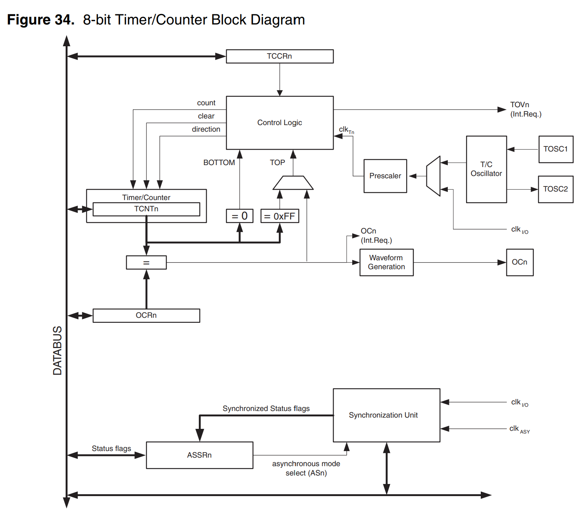
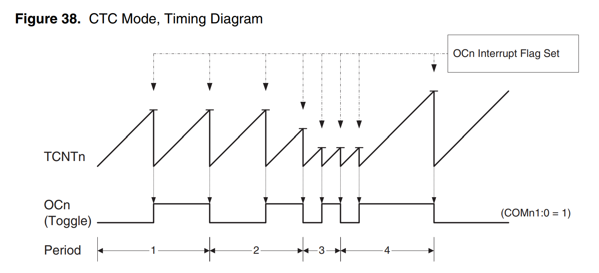
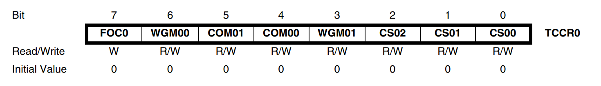

# TIMER 0/2 보고서

## 타이머 카운터란

타이머 카운터는 시간에 관련된 모든 작업을 수행한다. 일정 시간 간격 측정 또는 특정 이벤트 발생 횟수를 센다. 이 떄 클럭의 주파수를 알면 클럭 주기를 알 수 있으므로 타이머로 활용할 수 있다. 에를 들어 8비트 타이머/카운터의 경우 1111 1111에서 0000 0000으로 갈 때 오버플로우 인터럽트가 발생한다. 이 때 MCU 내부 클럭을 사용하면 타이머, 외부 클럭 또는 외부 이벤트를 사용하면 카운터이다. 

#### delay와 다른점
delay는 그 함수가 실행되는 시점에 모든 작업을 멈춘다. 이에 뒤에 있는 코드 실행에 영향을 미미거나, 인터럽트가 발생하지 않아 불편함이 생긴다. 이런 점들을 타이머/카운터를 활용하면 해결된다.

## 프리스케일러

Atmega128은 1초에 1600만번 진동하는 크리스탈이 있다.(16MHz) 다만 16MHz를 그대로 넣으면 1클럭당 0.0625마이크로 세컨드, 8비트 카운터는 256번 반복하니 16마이크로 세컨드마다 넘쳐버린다. 이는 너무 짧은 시간이다. 이 문제를 해결하기 위해 분주비가 나왔다. 예를 들어 64의 분주비를 걸면 16MHz / 64 = 250kHz 즉 4마이크로 세컨드 마다 1씩 증가하고 256번 반복하면 약 1ms가 나ㅘ서 문제가 해결된다. 득 프리스케일러를 한 마디로 설명하면 고속의 클럭을 사용할 때 나카나는 한계를 극복하기 위해 클럭을 나눠 더 느린 클럭을 생성하는 장치이다.
* timer0 / timer2가 가지는 분주비가 다르기 때문에 잘 선택해서 써야한다(timer0만 32,128을 가지지만 외부 핀 카운팅이 안된다. timer0의 외부 입력은 32.768kHz시계용 크리스털 전용 TOSC1/TOSC2이다.)

## bottom / max / top

* bottom : 항상 0x00
* max : 8비트 최댓값(항상 0xFF=255)  //하드웨어 스펙
* top : 모드에 따라 실제로 되돌아가는 지점. Normal/PWM에선 0xFF지만, CTC 모드에선 OCR0 값이 TOP이 됨  //내가 마음대로 정하는 값

## 주기 계산

* 1틱 시간 = 분주비 / 시스템클럭
* 인터럽트 주기 = 1틱 시간 × 세는 개수

세는 개수를 줄이는 방법은 두가지 인데 첫번째는 분주비를 바꾸는 방법이다. 이는 틱 하나의 길이 자체가 바뀐다. 두번째로 TCNT0 초기값을 바꾸는 방법인데 0부터 바뀌는게 아닌 중간부터 바뀐다.  
 
예를 들어 TCNT0 = 0에서 시작하면 0x00부터 0xFF까지 256번을 세고 오버플로우가 걸린다면 TCNT0 = 192에서 시작하면 64번만 세고 오버플로우가 발생한다. 
16MHz ÷ 64 = 4µs, 1ms ÷ 4µs = 250번, 256 - 250 = 6 -> TCNT0= 6 

## 레지스터
### TCCR0

* CS02:0 -> 분주비
* WGM01:00 -> 동작모드(0=Normal, 1=Phase Correct PWM, 2=CTC, 3=Fast PWM)
* COM01:00 -> OC0 핀(PB4) 출력 동작. PWM 안 쓸 땐 0으로 두면 됨.
* FOC0 -> 강제로 비교일치 시키는 스트로브

#### TCNT0 : 현재 카운트 값. 읽으면 지금 몇인지 알 수 있고, 쓰면 초기값 설정이 됨. 단, TCNT0에 쓰면 바로 다음 클럭의 비교일치가 무시됨.
#### OCR0 : 비교 대상 값. TCNT0이 이 값과 같아지는 순간 이벤트 발생. 
#### TIMSK / TIFR 
* TIMSK의 TOIE0(bit0) = 1 -> 오버플로 인터럽트 허용
* TIMSK의 OCIE0(bit1) = 1 -> 비교일치 인터럽트 허용
* TIFR의 TOV0, OCF0 = 하드웨어가 세우는 깃발

## Timer0 과 Timer2의 차이점

### 분주비 차이 
Timer2에는 32,128이 없음. 하지만 그 자리에 외부 클럭이 들어가 있음.

### Timer2의 외부 이벤트

T2핀에 펄스를 넣으면 엣지를 셈. 엔코더나 회전수 계측에 쓰임. 외부 클럭에는 프리스케일러 적용 안됨. Timer0의 TOSC1/TOSC2는 다른 용도로 이용됨.

### Timer0의 비동기 기능

Timer0은 ASSR 레지스터의 AS0 비트를 켜면 시스템 클럭을 끊고 TOSC1/TOSC2에 붙인 32.768kHz 시계용 크리스털로 돌아감. MCU가 슬립에 들어가도 시계는 흐르기 때문에 RTC가 됨. 

### Timer0의 프리스케일러 공유

Timer0는 전용프리스케일러인 PSR0가 있지만 Timer2는 Timer1,3과 같은 프리스케일러인 PSR321을 씀.