# Timer/Counter(PWM) Register 보고서

### TCCR1A

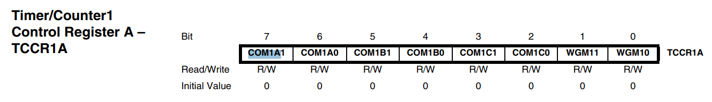

COM1A1:0        OC1A 핀 출력 동작 
COM1B1:0        OC1B 핀 출력 동작 
COM1C1:0        OC1C 핀 출력 동작 
WGM11:10        파형 모드 하위 2비트 
 
COM 비트는 Fast PWM에서 비반전/반전 을 표시할 떼 이용 가능 

### TCCR1B

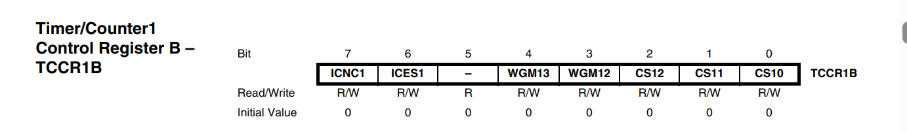

ICNC1	        입력 캡처 노이즈 제거 
ICES1	        캡처 엣지 선택 
WGM13:12	    파형 모드 상위 2비트 
CS12:10	        분주비 (001=1, 010=8, 011=64, 100=256, 101=1024) 

### TCCR1C

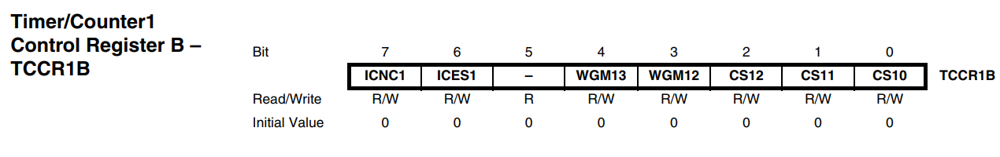

FOC1A/B/C |    강제 출력 비교     PWM가 아닌  모드에서만 의미 있어서 실제로는 거의 안 씀. 쓰기 전용이라 읽으면 항상 0이고 PWM 모드에서는 반드시 0으로 둬야 함.

### TCNT1

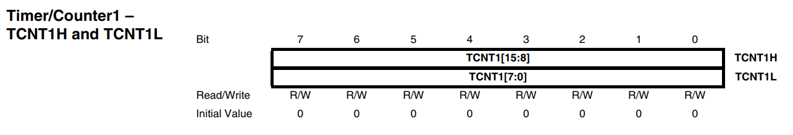

현제 카운터 값/    동작 중에 값을 쓰면 그 다음 한 클럭 동안 비교 일치가 무시되니, 가능하면 정지 상태에서 건드릴 것.

### OCR1 A/B/C

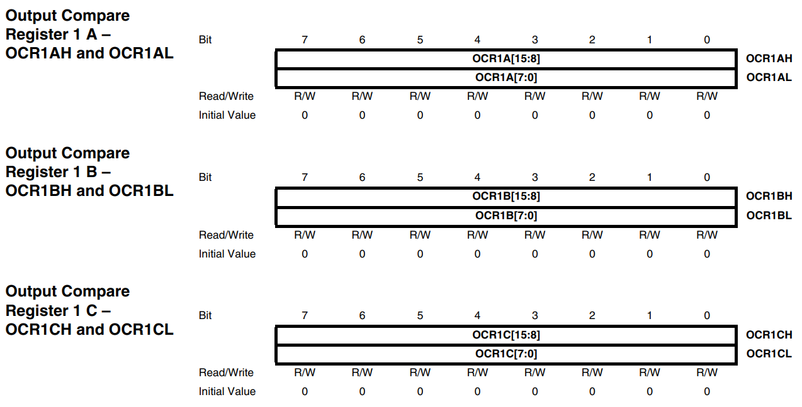

비교값/     PWM에서 듀티비를 결정     PWM 모드에서는 이중 버퍼로 동작해서 쓴 값이 탑/바텀 도달 시점에 반영됨 -> 듀티를 바꿔도 파형이 깨지지 않음. 비PWM 모드에서는 즉시 반영.

### ICR1

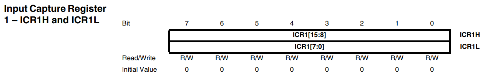

입력 캡처 레지스터/    mode 14에서는 TOP값으로 사용     OCR1A와 달리 이중 버퍼가 없어서 동작 중 TOP을 바꾸면 파형이 튈 수 있음. 대신 OCR1A를 TOP으로 안 써도 되니 OC1A 핀을 출력으로 살릴 수 있는 게 장점.

### TIMSK/ETIMSK

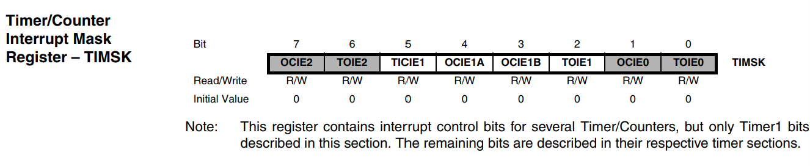
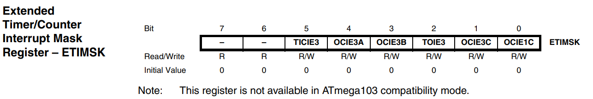

인터럽트 허용/   Timer1은 TIMSK에, Timer3과 OCIE1C는 ETIMSK에 흩어져 있는 게 포인트. (TIMSK: TICIE1, OCIE1A, OCIE1B, TOIE1 / ETIMSK: TICIE3, OCIE3A, OCIE3B, TOIE3, OCIE3C, OCIE1C)

### TIFR/ETIFR

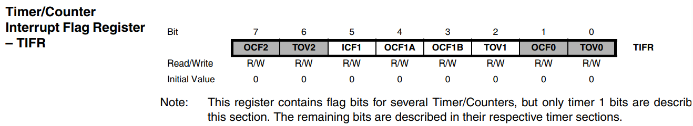
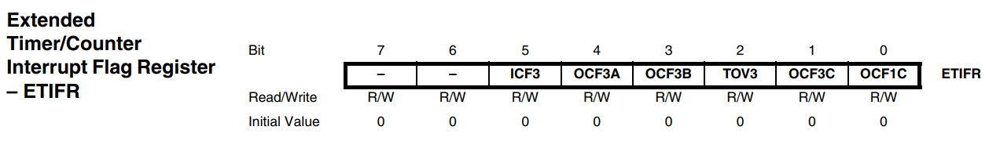

인터럽트 플래그/     해당 ISR이 실행되면 자동으로 지워지고, 수동으로 지울 땐 0이 아니라 1을 써야 함.

### SFIOR

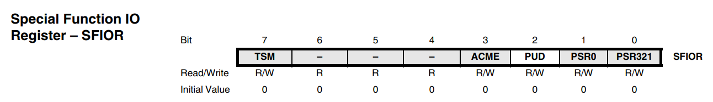

PSR321: 프리스케일러 강제 리셋/    Timer1,2,3이 프리스케일러를 공유해서 이 비트 하나에 셋 다 리셋됨. 리셋 후 하드웨어가 자동으로 0으로 되돌림.